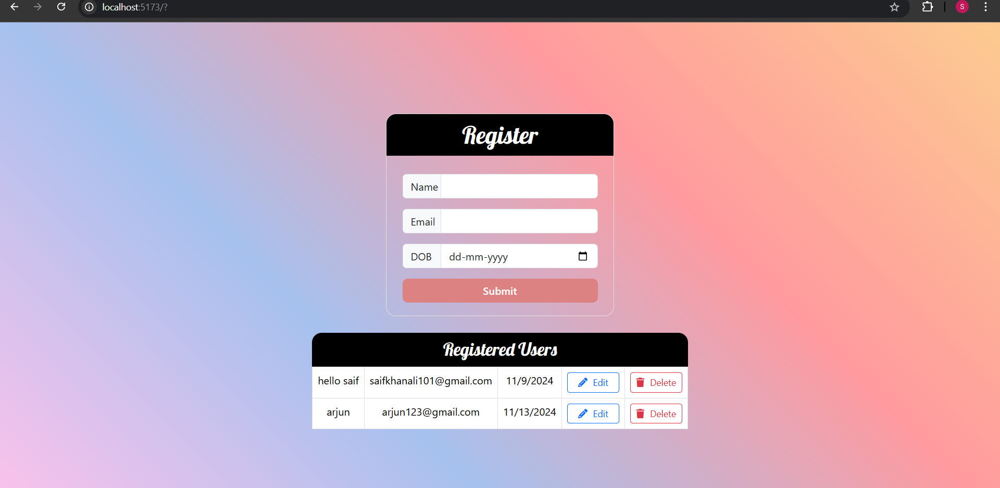

# User Registration Form

A full-stack application that allows users to register, edit, and delete user data with a form. It uses React on the front end and Node.js with Express and MongoDB on the back end.

## Features
- **User Registration**: Users can enter their name, email, and date of birth.
- **Edit User**: Edit existing user details.
- **Delete User**: Remove users from the database.
- **View Users**: List of all registered users.

## Tech Stack
- **Frontend**: React, Axios, Vite
- **Backend**: Node.js, Express, MongoDB
- **Styling**: CSS (custom styles)

## Getting Started

### Prerequisites
1. **MongoDB**: Make sure MongoDB is installed and running locally or use MongoDB Atlas for cloud based Database.
2. **Node.js**: Ensure that Node.js is installed on your desktop.

### Explanation:
1. **Backend**: 
   - Navigate to the backend folder and run `npm install` to install dependencies.
   - Set up your MongoDB connection by adding the Mongo URI to the `.env` file.
   - Run the server with `npm run dev` which starts the backend on `http://localhost:5000`.

2. **Frontend**: 
   - Navigate to the frontend folder and run `npm install` to install frontend dependencies.
   - Run the frontend server with `npm run dev`, and open `http://localhost:3000` in your browser to start using the app.

